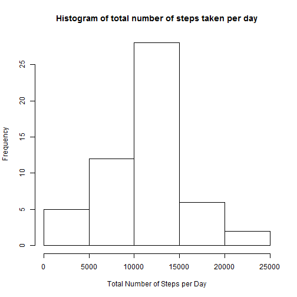
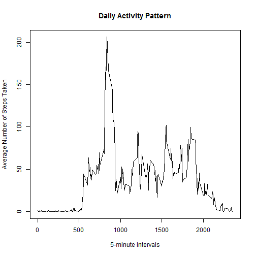
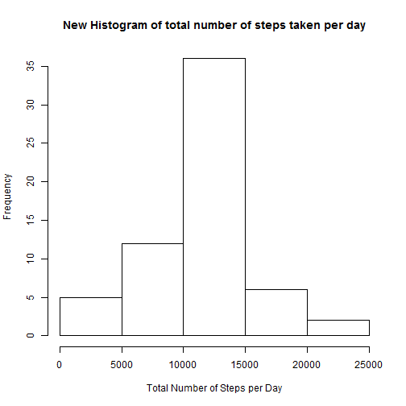
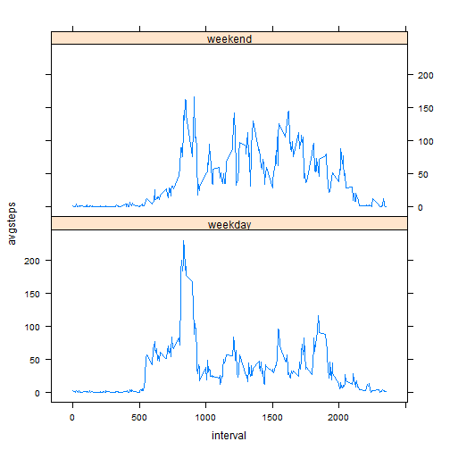

## Loading and preprocessing the data

Read the data into R (assumes file is in your working directory)

```r
activitydata <- read.csv("activity.csv")
```

Convert date column to correct format

```r
activitydata$date<-as.Date(activitydata$date, format= "%m/%d/%Y")
```


## What is mean total number of steps taken per day?

Make a histogram of the total number of steps taken each day


```r
aggregatesteps<- aggregate(activitydata$steps, list(activitydata$date), FUN = "sum")

hist(aggregatesteps$x, main = "Histogram of total number of steps taken per day",xlab="Total Number of Steps per Day")
```

 


Calculate and report the mean and median total number of steps taken per day

The mean is:

```r
mean(aggregatesteps$x,na.rm=TRUE) 
```

```
## [1] 10766.19
```

The median is:

```r
median(aggregatesteps$x,na.rm=TRUE)
```

```
## [1] 10765
```

## What is the average daily activity pattern?

Make a time series plot (i.e. type = "l") of the 5-minute interval (x-axis) and the average number of steps taken, averaged across all days (y-axis)


```r
aggregatestepsavg<-aggregate(activitydata$steps, list(activitydata$interval), FUN = "mean", na.rm=TRUE)

names(aggregatestepsavg)<- c("interval", "avgsteps")

plot(aggregatestepsavg$interval, aggregatestepsavg$avgsteps, type = "l", main = "Daily Activity Pattern", xlab = "5-minute Intervals", ylab = "Average Number of Steps Taken")
```

 

Which 5-minute interval, on average across all the days in the dataset, contains the maximum number of steps?


```r
maxsteps<-which.max(aggregatestepsavg$avgsteps)
maxinterval<-aggregatestepsavg[maxsteps,]$interval
maxinterval
```

```
## [1] 835
```


## Imputing missing values

Note that there are a number of days/intervals where there are missing values (coded as NA). The presence of missing days may introduce bias into some calculations or summaries of the data.

Calculate and report the total number of missing values in the dataset (i.e. the total number of rows with NAs)


```r
sum(is.na(activitydata))
```

```
## [1] 2304
```

Devise a strategy for filling in all of the missing values in the dataset. The strategy does not need to be sophisticated. For example, you could use the mean/median for that day, or the mean for that 5-minute interval, etc.

I decided to use the mean for that 5-minute interval.

Create a new dataset that is equal to the original dataset but with the missing data filled in.

I created a for loop where every NA value in the steps column was replaced with the average number of steps for that 5 min interval.


```r
newactivitydata<-activitydata
for (i in 1:nrow(newactivitydata)) {
       if (is.na(newactivitydata$steps[i])) {
                newactivitydata$steps[i] <-aggregatestepsavg[which(newactivitydata$interval[i] == aggregatestepsavg$interval),]$avgsteps
       }
  }

 sum(is.na(newactivitydata))
```

```
## [1] 0
```


Make a histogram of the total number of steps taken each day and Calculate and report the mean and median total number of steps taken per day. Do these values differ from the estimates from the first part of the assignment? What is the impact of imputing missing data on the estimates of the total daily number of steps?


```r
newaggregatesteps<- aggregate(newactivitydata$steps, list(newactivitydata$date), FUN = "sum")

hist(newaggregatesteps$x, main = "New Histogram of total number of steps taken per day",xlab="Total Number of Steps per Day")
```

 

The mean is:

```r
mean(newaggregatesteps$x) 
```

```
## [1] 10766.19
```

The median is:

```r
median(newaggregatesteps$x)
```

```
## [1] 10766.19
```

So as we can see even after replacing all the NA values with the average number of steps taken in that interval, there is no change in the mean which is 10766.19 and there is a very minimal change in the median which was 10765 but changed to 10766.19 after the NA values were replaced.

## Are there differences in activity patterns between weekdays and weekends?

Are there differences in activity patterns between weekdays and weekends?

For this part the weekdays() function may be of some help here. Use the dataset with the filled-in missing values for this part.

Create a new factor variable in the dataset with two levels - "weekday" and "weekend" indicating whether a given date is a weekday or weekend day.


```r
newactivitydata$weekday <- factor(weekdays(newactivitydata$date, abbreviate=FALSE))

levels(newactivitydata$weekday) <- list(weekday= c("Monday", "Tuesday", "Wednesday", "Thursday", "Friday"), weekend = c("Saturday", "Sunday"))
```


Make a panel plot containing a time series plot (i.e. type = "l") of the 5-minute interval (x-axis) and the average number of steps taken, averaged across all weekday days or weekend days (y-axis). See the README file in the GitHub repository to see an example of what this plot should look like using simulated data.


```r
aggregateweekday<- aggregate(newactivitydata$steps, list(newactivitydata$interval, newactivitydata$weekday), FUN = "mean")

names(aggregateweekday)<- c("interval", "weekday", "avgsteps")


library(lattice)
xyplot(avgsteps ~ interval | factor(weekday), data = aggregateweekday, 
layout = c(1,2),  type = "l")
```

 
